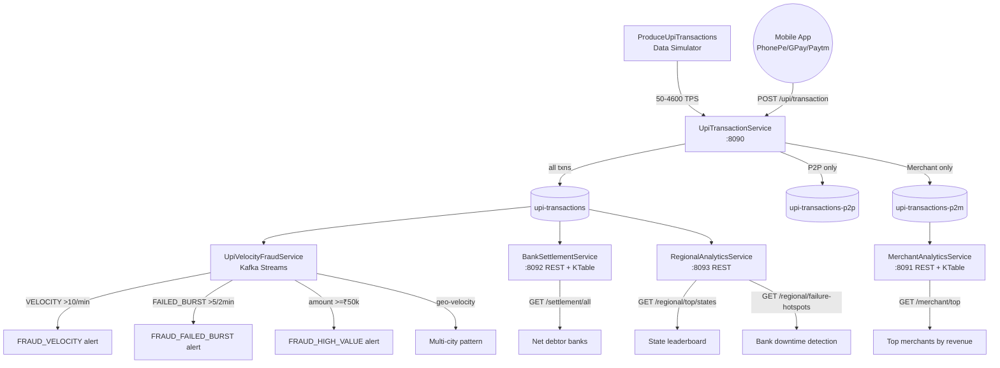
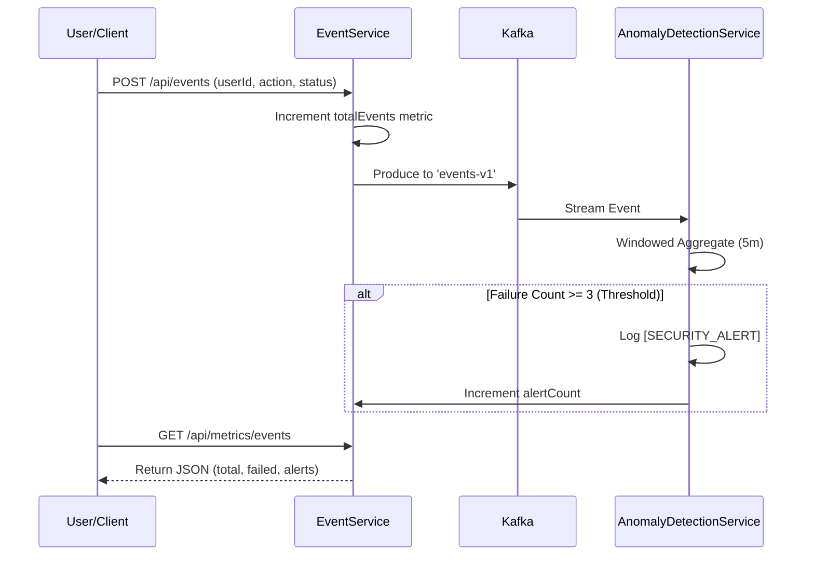

# India UPI Real-Time Payment Streaming System

[](https://opensource.org/licenses/Apache-2.0)
[](https://kafka.apache.org/)
[](https://www.oracle.com/java/)
[](https://github.com/tanmaymish/event-stream-processing-system/actions/workflows/deploy.yml)
[](#)
[](#)

A production-grade, distributed real-time streaming system modelled on **India's UPI (Unified Payments Interface)** — the world's largest real-time payments network processing **400+ million transactions/day** across 300+ million users. Built on Apache Kafka and Kafka Streams.

## What is mine, and what this is built on

This repository is a fork of [confluentinc/kafka-streams-examples](https://github.com/confluentinc/kafka-streams-examples)
(Apache 2.0). Confluent's examples, their build, and their `microservices` order-management
demo are theirs; everything from `Upi*` down is the UPI system I wrote on top of it.

**Written by me** — the India UPI payment system, under
`src/main/java/io/confluent/examples/streams/microservices/`:

| File | What it does |
| --- | --- |
| `UpiTransactionService` | REST ingest gateway, fan-out to three topics |
| `UpiVelocityFraudService` | Kafka Streams fraud topology, four patterns, alert sink |
| `MerchantAnalyticsService` | Merchant revenue KTable + interactive queries |
| `BankSettlementService` | Inter-bank net settlement positions |
| `RegionalAnalyticsService` | State and city analytics, failure hotspots |
| `util/ProduceUpiTransactions` | Load simulator with realistic UPI distributions |
| `domain/beans/Upi*` | Transaction and alert wire formats |
| `UpiVelocityFraudServiceTest` | Fraud topology tests (TopologyTestDriver) |
| `docker-compose.upi.yml`, `Dockerfile` | Local stack and image |

**Inherited from Confluent** — the Maven build, the Avro schemas and generated sources, the
`orders`/`inventory`/`payments` microservices demo, and every non-UPI example and test in
`src/`. The Confluent documentation for those still sits at the bottom of this README.

The package names are Confluent's because the UPI services were added inside their source
tree rather than beside it. That was a shortcut and it is the honest reason the code sits
under `io.confluent.examples`.

## What This System Does

India's UPI ecosystem involves multiple banks, payment apps (PhonePe, Google Pay, Paytm, BHIM), and 25+ million merchants. Every ₹10 chai payment and ₹2L rent transfer flows through NPCI in real time. This system handles:

- **Real-time ingestion** of UPI transactions via REST gateway (P2P + P2M routing)
- **Multi-pattern fraud detection** via Kafka Streams windowed aggregations
- **Live merchant analytics** — Swiggy, Zomato, Amazon, Ola revenue dashboards
- **Inter-bank settlement tracking** — NPCI net position per bank (SBI, HDFC, ICICI, Axis...)
- **Regional dashboards** — state-wise and city-wise UPI adoption analytics
- **Realistic data simulation** — log-normal amount distribution, weighted city selection, 94% success rate

## System Architecture



## Services & Ports

| Service | Port | Description |
|---|---|---|
| `UpiTransactionService` | 8090 | REST gateway — ingests UPI transactions, routes to Kafka |
| `MerchantAnalyticsService` | 8091 | Live merchant revenue KTable + REST queries |
| `BankSettlementService` | 8092 | Inter-bank NPCI net settlement positions |
| `RegionalAnalyticsService` | 8093 | State/city level UPI adoption analytics |
| `UpiVelocityFraudService` | — | Stream processor — velocity/burst/high-value fraud |

## Kafka Topics

| Topic | Key | Purpose |
|---|---|---|
| `upi-transactions` | senderVpa | All UPI transactions (source of truth) |
| `upi-transactions-p2p` | senderVpa | Peer-to-peer transfers only |
| `upi-transactions-p2m` | merchantId | Merchant payments only |
| `upi-fraud-alerts` | senderVpa | `UpiAlertBean` JSON, one per detected pattern |

## Fraud Detection Patterns

`UpiVelocityFraudService` runs four detectors over `upi-transactions` and publishes every
finding to `upi-fraud-alerts` as a JSON `UpiAlertBean`, keyed by sender VPA. Alerts are data
on a topic, not just log lines, so a case queue or dashboard can consume them.

| Pattern | Fires when | Severity | Window |
| --- | --- | --- | --- |
| `VELOCITY_FRAUD` | 10 transactions from one VPA | CRITICAL | 1 min |
| `FAILED_BURST` | 5 failed transactions from one VPA | HIGH | 2 min |
| `HIGH_VALUE_SPIKE` | one success at or above ₹50,000 (CRITICAL at ₹1,00,000) | MEDIUM/CRITICAL | none |
| `MULTI_CITY` | one VPA transacts from 2 distinct cities | HIGH | 5 min |

Two properties matter as much as the thresholds:

- **One alert per window, not one per record.** A detector fires on the record that *crosses*
  the threshold, so a script sending 50 transactions a minute raises one alert instead of 41.
  This is what keeps the alert topic usable as a work queue.
- **`MULTI_CITY` genuinely correlates cities.** It aggregates the distinct city set per VPA
  and fires when a second city joins it, and it fires only on the record that added that
  city. Repeated activity in a single city is not geo-velocity and does not alert.

Thresholds and windows are constants at the top of `UpiVelocityFraudService`.

### Tests

The fraud topology is driven by `TopologyTestDriver`, so the patterns are asserted on
without a broker, a schema registry, or Docker:

```bash
mvn -B test -s .mvn/settings.xml -Dtest='Upi*Test' -Dcheckstyle.skip=true
```

The tests pin down the behaviour an on-call analyst depends on: an alert fires at the
threshold and not before, it fires once per window, a window boundary resets the count,
failures do not count towards velocity, and a malformed record cannot take the pipeline
down. They run in CI on every push and the image build will not start until they pass.

## Quick Start

```bash
# Start Kafka
docker-compose up -d

# Start the UPI gateway (port 8090)
java -cp target/kafka-streams-examples-*.jar \
  io.confluent.examples.streams.microservices.UpiTransactionService

# Start fraud detection
java -cp target/kafka-streams-examples-*.jar \
  io.confluent.examples.streams.microservices.UpiVelocityFraudService

# Start merchant analytics (port 8091)
java -cp target/kafka-streams-examples-*.jar \
  io.confluent.examples.streams.microservices.MerchantAnalyticsService

# Start bank settlement tracker (port 8092)
java -cp target/kafka-streams-examples-*.jar \
  io.confluent.examples.streams.microservices.BankSettlementService

# Start regional analytics (port 8093)
java -cp target/kafka-streams-examples-*.jar \
  io.confluent.examples.streams.microservices.RegionalAnalyticsService

# Run simulator: 100 TPS for 60 seconds
java -cp target/kafka-streams-examples-*.jar \
  io.confluent.examples.streams.microservices.util.ProduceUpiTransactions \
  localhost:9092 100 60
```

## Example API Calls

```bash
# Submit a UPI transaction (Swiggy food order)
curl -X POST http://localhost:8090/upi/transaction \
  -H 'Content-Type: application/json' \
  -d '{
    "txnId": "UPI1234567890",
    "senderVpa": "rahul.sharma42@oksbi",
    "receiverVpa": "swiggy_ind@okaxis",
    "senderBank": "SBI",
    "receiverBank": "Axis",
    "amountInr": 349.00,
    "status": "SUCCESS",
    "category": "Food & Dining",
    "merchantName": "Swiggy",
    "merchantId": "swiggy_ind",
    "senderCity": "Bangalore",
    "senderState": "Karnataka",
    "deviceType": "ANDROID",
    "upiApp": "PHONEPE",
    "timestamp": 1719500000000
  }'

# Get gateway metrics
curl http://localhost:8090/upi/metrics

# Top merchants by UPI revenue
curl http://localhost:8091/merchant/top?limit=5

# Merchants in Food & Dining category
curl http://localhost:8091/merchant/category/Food%20%26%20Dining

# SBI's net settlement position
curl http://localhost:8092/settlement/SBI

# All banks ranked by net position (positive = net receiver)
curl http://localhost:8092/settlement/all

# Banks in deficit (need to fund NPCI before settlement window)
curl http://localhost:8092/settlement/debtors

# Karnataka state stats
curl http://localhost:8093/regional/state/Karnataka

# Bangalore city stats
curl http://localhost:8093/regional/city/Bangalore

# Top 10 states by UPI volume
curl http://localhost:8093/regional/top/states

# States with high failure rates (bank downtime detection)
curl http://localhost:8093/regional/failure-hotspots
```

## India UPI Data Modelled

- **UPI Handles**: `@oksbi`, `@okhdfcbank`, `@okicici`, `@okaxis`, `@ybl` (PhonePe), `@paytm`, `@apl` (Amazon Pay), `@kotak`, `@pnb`, `@upi` (BHIM)
- **Cities** (weighted by UPI adoption): Mumbai, Delhi, Bangalore, Hyderabad, Chennai, Pune, Kolkata, Ahmedabad, Jaipur, Lucknow, + 10 more
- **Merchants**: Swiggy, Zomato, Amazon, Flipkart, Myntra, BigBasket, Blinkit, Ola, Uber, IRCTC, MakeMyTrip, Airtel, Jio, BESCOM and more
- **Amount distribution**: Log-normal (₹10 chai → ₹2L rent) matching real UPI patterns
- **Success rate**: 94% (matches NPCI reported UPI success rates)
- **Failure reasons**: INSUFFICIENT_BALANCE, INVALID_VPA, WRONG_PIN, BANK_SERVER_DOWN, TRANSACTION_LIMIT_EXCEEDED, RBI_LIMIT_EXCEEDED

## Original Event Processing System

## 🛠 User Lifecycle & Data Flow




> [!NOTE]
> This repo is replaced with [Confluent Tutorials for Apache Kafka](https://github.com/confluentinc/tutorials).
We still "keep the lights on", but we don't improve existing examples any longer, nor do we add new example.


---
Table of Contents

* [Available examples](#available-examples)
    * [Examples: Runnable Applications](#examples-apps)
    * [Examples: Unit Tests](#examples-unit-tests)
    * [Examples: Integration Tests](#examples-integration-tests)
    * [Docker Example: Kafka Music demo application](#examples-docker)
    * [Examples: Event Streaming Platform](#examples-event-streaming-platform)
* [Requirements](#requirements)
    * [Apache Kafka](#requirements-kafka)
    * [Confluent Platform](#requirements-confluent-platform)
    * [Using IntelliJ or Eclipse](#requirements-ide)
    * [Java](#requirements-java)
    * [Scala](#requirements-scala)
* [Packaging and running the examples](#packaging-and-running)
* [Development](#development)
* [Version Compatibility Matrix](#version-compatibility)
* [Where to find help](#help)

---


<a name="available-examples"/>

# Available examples

This repository has several branches to help you find the correct code examples for the version of Apache Kafka and/or
Confluent Platform that you are using.  See [Version Compatibility Matrix](#version-compatibility) below for details.

There are three kinds of examples:

* **Examples under [src/main/](src/main/)**: These examples are short and concise.  Also, you can interactively
  test-drive these examples, e.g. against a local Kafka cluster.  If you want to actually run these examples, then you
  must first install and run Apache Kafka and friends, which we describe in section
  [Packaging and running the examples](#packaging-and-running).  Each example also states its exact requirements and
  instructions at the very top.
* **Examples under [src/test/](src/test/)**: These examples should test applications under [src/main/](src/main/).
  Unit Tests with TopologyTestDriver test the stream logic without external system dependencies.
  The integration tests use an embedded Kafka
  clusters, feed input data to them (using the standard Kafka producer client), process the data using Kafka Streams,
  and finally read and verify the output results (using the standard Kafka consumer client).
  These examples are also a good starting point to learn how to implement your own end-to-end integration tests.
* **Ready-to-run Docker Examples**: These examples are already built and containerized.


<a name="examples-apps"/>

## Examples: Runnable Applications

Additional examples may be found under [src/main/](src/main/java/io/confluent/examples/streams/).

| Application Name            | Concepts used                                            | Java 8+ | Java 7+ | Scala |
| --------------------------- | -------------------------------------------------------- | ------- | ------- | ----- |
| WordCount                   | DSL, aggregation, stateful                               | [Java 8+ example](src/main/java/io/confluent/examples/streams/WordCountLambdaExample.java) | | [Scala Example](src/main/scala/io/confluent/examples/streams/WordCountScalaExample.scala) |
| MapFunction                 | DSL, stateless transformations, `map()`                  | [Java 8+ example](src/main/java/io/confluent/examples/streams/MapFunctionLambdaExample.java) | | [Scala Example](src/main/scala/io/confluent/examples/streams/MapFunctionScalaExample.scala) |
| SessionWindows              | Sessionization of user events, user behavior analysis    | | [Java 7+ example](src/main/java/io/confluent/examples/streams/SessionWindowsExample.java)
| GlobalKTable                | `join()` between `KStream` and `GlobalKTable`            | [Java 8+ example](src/main/java/io/confluent/examples/streams/GlobalKTablesExample.java) | | |
| GlobalStore                 | "join" between `KStream` and `GlobalStore`               | [Java 8+ example](src/main/java/io/confluent/examples/streams/GlobalStoresExample.java) | | |
| PageViewRegion              | `join()` between `KStream` and `KTable`                  | [Java 8+ example](src/main/java/io/confluent/examples/streams/PageViewRegionLambdaExample.java) | [Java 7+ example](src/main/java/io/confluent/examples/streams/PageViewRegionExample.java) | |
| PageViewRegionGenericAvro   | Working with data in Generic Avro format                 | [Java 8+ example](src/main/java/io/confluent/examples/streams/PageViewRegionLambdaExample.java) | [Java 7+ example](src/main/java/io/confluent/examples/streams/PageViewRegionExample.java) | |
| WikipediaFeedSpecificAvro   | Working with data in Specific Avro format                | [Java 8+ example](src/main/java/io/confluent/examples/streams/WikipediaFeedAvroLambdaExample.java) | [Java 7+ example](src/main/java/io/confluent/examples/streams/WikipediaFeedAvroExample.java) | |
| SecureKafkaStreams          | Secure, encryption, client authentication                | | [Java 7+ example](src/main/java/io/confluent/examples/streams/SecureKafkaStreamsExample.java) | |
| Sum                         | DSL, stateful transformations, `reduce()`                | [Java 8+ example](src/main/java/io/confluent/examples/streams/SumLambdaExample.java) | | |
| WordCountInteractiveQueries | Interactive Queries, REST, RPC                           | [Java 8+ example](src/main/java/io/confluent/examples/streams/interactivequeries/WordCountInteractiveQueriesExample.java) | | |
| KafkaMusic                  | Interactive Queries, State Stores, REST API              | [Java 8+ example](src/main/java/io/confluent/examples/streams/interactivequeries/kafkamusic/KafkaMusicExample.java) | | |
| ApplicationReset            | Application Reset Tool `kafka-streams-application-reset` | [Java 8+ example](src/main/java/io/confluent/examples/streams/ApplicationResetExample.java) | | |
| Microservice                | Microservice ecosystem, state stores, dynamic routing, joins, filtering, branching, stateful operations | [Java 8+ example](src/main/java/io/confluent/examples/streams/microservices) | | |
| Event Processing System     | REST API, Anomaly Detection, Metrics, Structured Logging, Time Windows | [EventService.java](src/main/java/io/confluent/examples/streams/microservices/EventService.java) | | |


<a name="examples-unit-tests"/>

## Examples: Unit Tests

The stream processing of Kafka Streams can be **unit tested** with the `TopologyTestDriver` from the
`org.apache.kafka:kafka-streams-test-utils` artifact. The test driver allows you to write sample input into your
processing topology and validate its output.

See the documentation at [Testing Streams Code](https://docs.confluent.io/current/streams/developer-guide/test-streams.html).


<a name="examples-integration-tests"/>

## Examples: Integration Tests

We also provide several **integration tests**, which demonstrate end-to-end data pipelines.  Here, we spawn embedded Kafka
clusters and the [Confluent Schema Registry](https://github.com/confluentinc/schema-registry), feed input data to them
(using the standard Kafka producer client), process the data using Kafka Streams, and finally read and verify the output
results (using the standard Kafka consumer client).

Additional examples may be found under [src/test/](src/test/java/io/confluent/examples/streams/).

> Tip: Run `mvn test` to launch the tests.

| Integration Test Name               | Concepts used                               | Java 8+ | Java 7+ | Scala |
| ----------------------------------- | ------------------------------------------- | ------- | ------- | ----- |
| WordCount                           | DSL, aggregation, stateful                  | [Java 8+ Example](src/test/java/io/confluent/examples/streams/WordCountLambdaIntegrationTest.java) | | [Scala Example](src/test/scala/io/confluent/examples/streams/WordCountScalaIntegrationTest.scala) |
| WordCountInteractiveQueries         | Interactive Queries, REST, RPC              | | [Java 7+ Example](src/test/java/io/confluent/examples/streams/interactivequeries/WordCountInteractiveQueriesExampleTest.java) | |
| Aggregate                           | DSL, `groupBy()`, `aggregate()`             | [Java 8+ Example](src/test/java/io/confluent/examples/streams/AggregateTest.java) | | [Scala Example](src/test/scala/io/confluent/examples/streams/AggregateScalaTest.scala) |
| CustomStreamTableJoin               | DSL, Processor API, Transformers            | [Java 8+ Example](src/test/java/io/confluent/examples/streams/CustomStreamTableJoinIntegrationTest.java) | | |
| EventDeduplication                  | DSL, Processor API, Transformers            | [Java 8+ Example](src/test/java/io/confluent/examples/streams/EventDeduplicationLambdaIntegrationTest.java) | | |
| GlobalKTable                        | DSL, global state                           | | [Java 7+ Example](src/test/java/io/confluent/examples/streams/GlobalKTablesExampleTest.java) | |
| GlobalStore                         | DSL, global state, Transformers             | | [Java 7+ Example](src/test/java/io/confluent/examples/streams/GlobalStoresExampleTest.java) | |
| HandlingCorruptedInputRecords       | DSL, `flatMap()`                            | [Java 8+ Example](src/test/java/io/confluent/examples/streams/HandlingCorruptedInputRecordsIntegrationTest.java) | | |
| KafkaMusic (Interactive Queries)    | Interactive Queries, State Stores, REST API | | [Java 7+ Example](src/test/java/io/confluent/examples/streams/interactivequeries/kafkamusic/KafkaMusicExampleTest.java) | |
| MapFunction                         | DSL, stateless transformations, `map()`     | [Java 8+ Example](src/test/java/io/confluent/examples/streams/MapFunctionLambdaIntegrationTest.java) | | |
| MixAndMatch DSL + Processor API     | Integrating DSL and Processor API           | [Java 8+ Example](src/test/java/io/confluent/examples/streams/MixAndMatchLambdaIntegrationTest.java) | | |
| PassThrough                         | DSL, `stream()`, `to()`                     | | [Java 7+ Example](src/test/java/io/confluent/examples/streams/PassThroughIntegrationTest.java) | |
| PoisonPill                          | DSL, `flatMap()`                            | [Java 8+ Example](src/test/java/io/confluent/examples/streams/HandlingCorruptedInputRecordsIntegrationTest.java) | | |
| ProbabilisticCounting\*\*\*         | DSL, Processor API, custom state stores     | | | [Scala Example](src/test/scala/io/confluent/examples/streams/ProbabilisticCountingScalaIntegrationTest.scala) |
| Reduce (Concatenate)                | DSL, `groupByKey()`, `reduce()`             | [Java 8+ Example](src/test/java/io/confluent/examples/streams/ReduceTest.java) | | [Scala Example](src/test/scala/io/confluent/examples/streams/ReduceScalaTest.scala) |
| SessionWindows                      | DSL, windowed aggregation, sessionization   | | [Java 7+ Example](src/test/java/io/confluent/examples/streams/SessionWindowsExampleTest.java) | |
| StatesStoresDSL                     | DSL, Processor API, Transformers            | [Java 8+ Example](src/test/java/io/confluent/examples/streams/StateStoresInTheDSLIntegrationTest.java) | | |
| StreamToStreamJoin                  | DSL, `join()` between KStream and KStream   | | [Java 7+ Example](src/test/java/io/confluent/examples/streams/StreamToStreamJoinIntegrationTest.java) | |
| StreamToTableJoin                   | DSL, `join()` between KStream and KTable    | | [Java 7+ Example](src/test/java/io/confluent/examples/streams/StreamToTableJoinIntegrationTest.java) | [Scala Example](src/test/scala/io/confluent/examples/streams/StreamToTableJoinScalaIntegrationTest.scala) |
| Sum                                 | DSL, aggregation, stateful, `reduce()`      | [Java 8+ Example](src/test/java/io/confluent/examples/streams/SumLambdaIntegrationTest.java) | | |
| TableToTableJoin                    | DSL, `join()` between KTable and KTable     | | [Java 7+ Example](src/test/java/io/confluent/examples/streams/TableToTableJoinIntegrationTest.java) | |
| UserCountsPerRegion                 | DSL, aggregation, stateful, `count()`       | [Java 8+ Example](src/test/java/io/confluent/examples/streams/UserCountsPerRegionLambdaIntegrationTest.java) | | |
| ValidateStateWithInteractiveQueries | Interactive Queries for validating state    | | [Java 8+ Example](src/test/java/io/confluent/examples/streams/ValidateStateWithInteractiveQueriesLambdaIntegrationTest.java) | | |
| GenericAvro                         | Working with data in Generic Avro format    | | [Java 7+ Example](src/test/java/io/confluent/examples/streams/GenericAvroIntegrationTest.java) |  [Scala Example](src/test/scala/io/confluent/examples/streams/GenericAvroScalaIntegrationTest.scala) |
| SpecificAvro                        | Working with data in Specific Avro format   | | [Java 7+ Example](src/test/java/io/confluent/examples/streams/SpecificAvroIntegrationTest.java) | [Scala Example](src/test/scala/io/confluent/examples/streams/SpecificAvroScalaIntegrationTest.scala) |

\*\*\*demonstrates how to probabilistically count items in an input stream by implementing a custom state store
([CMSStore](src/main/scala/io/confluent/examples/streams/algebird/CMSStore.scala)) that is backed by a
[Count-Min Sketch](https://en.wikipedia.org/wiki/Count%E2%80%93min_sketch) data structure (with the CMS implementation
of [Twitter Algebird](https://github.com/twitter/algebird))


<a name="examples-docker"/>

# Docker Example: Kafka Music demo application

This containerized example launches:

* Confluent's Kafka Music demo application for the Kafka Streams API, which makes use of
  [Interactive Queries](http://docs.confluent.io/current/streams/developer-guide.html)
* a single-node Apache Kafka cluster with a single-node ZooKeeper ensemble
* a [Confluent Schema Registry](https://github.com/confluentinc/schema-registry) instance

The Kafka Music application demonstrates how to build of a simple music charts application that continuously computes,
in real-time, the latest charts such as latest Top 5 songs per music genre.  It exposes its latest processing results
-- the latest charts -- via Kafka’s [Interactive Queries](http://docs.confluent.io/current/streams/developer-guide.html#interactive-queries)
feature via a REST API.  The application's input data is in Avro format, hence the use of Confluent Schema Registry,
and comes from two sources: a stream of play events (think: "song X was played") and a stream of song metadata ("song X
was written by artist Y").

You can find detailed documentation at
https://docs.confluent.io/current/streams/kafka-streams-examples/docs/index.html.


<a name="event-streaming-platform"/>

# Examples: Event Streaming Platform

For additional examples that showcase Kafka Streams applications within an event streaming platform, please refer to the [examples GitHub repository](https://github.com/confluentinc/examples).


<a name="requirements"/>

# Requirements

<a name="requirements-kafka"/>

## Apache Kafka

The code in this repository requires Apache Kafka 0.10+ because from this point onwards Kafka includes its
[Kafka Streams](https://github.com/apache/kafka/tree/trunk/streams) library.
See [Version Compatibility Matrix](#version-compatibility) for further details, as different branches of this
repository may have different Kafka requirements.

> **For the `master` branch:** To build a development version, you typically need the latest `trunk` version of Apache Kafka
> (cf. `kafka.version` in [pom.xml](pom.xml) for details).  The following instructions will build and locally install
> the latest `trunk` Kafka version:
>
> ```shell
> $ git clone git@github.com:apache/kafka.git
> $ cd kafka
> $ git checkout trunk
>
> # Now build and install Kafka locally
> $ ./gradlew clean && ./gradlewAll install
> ```


<a name="requirements-confluent-platform"/>

## Confluent Platform

The code in this repository requires [Confluent Schema Registry](https://github.com/confluentinc/schema-registry).
See [Version Compatibility Matrix](#version-compatibility) for further details, as different branches of this
repository have different Confluent Platform requirements.

* [Confluent Platform Quickstart](http://docs.confluent.io/current/quickstart.html) (how to download and install)
* [Confluent Platform documentation](http://docs.confluent.io/current/)

> **For the `master` branch:** To build a development version, you typically need the latest `master` version of Confluent Platform's
> Schema Registry (cf. `confluent.version` in [pom.xml](pom.xml), which is set by the upstream
> [Confluent Common](https://github.com/confluentinc/common) project).
> The following instructions will build and locally install the latest `master` Schema Registry version, which includes
> building its dependencies such as [Confluent Common](https://github.com/confluentinc/common) and
> [Confluent Rest Utils](https://github.com/confluentinc/rest-utils).
> Please read the [Schema Registry README](https://github.com/confluentinc/schema-registry) for details.
>
> ```shell
> $ git clone https://github.com/confluentinc/common.git
> $ cd common
> $ git checkout master
>
> # Build and install common locally
> $ mvn -DskipTests=true clean install
>
> $ git clone https://github.com/confluentinc/rest-utils.git
> $ cd rest-utils
> $ git checkout master
>
> # Build and install rest-utils locally
> $ mvn -DskipTests=true clean install
>
> $ git clone https://github.com/confluentinc/schema-registry.git
> $ cd schema-registry
> $ git checkout master
>
> # Now build and install schema-registry locally
> $ mvn -DskipTests=true clean install
> ```

Also, each example states its exact requirements at the very top.


<a name="requirements-ide"/>

## Using IntelliJ or Eclipse

If you are using an IDE and import the project you might end up with a "missing import / class not found" error.
Some Avro classes are generated from schema files and IDEs sometimes do not generate these classes automatically.
To resolve this error, manually run:

```shell
$ mvn -Dskip.tests=true compile
```

If you are using Eclipse, you can also right-click on `pom.xml` file and choose _Run As > Maven generate-sources_.


<a name="requirements-java"/>

## Java 17+

IntelliJ IDEA users:

* Open _File > Project structure_
* Select "Project" on the left.
    * Set "Project SDK" to Java 17.
    * Set "Project language level" to "17 - Sealed types, always-strict floating-point semantics"


<a name="requirements-scala"/>

## Scala

> Scala is required only for the Scala examples in this repository.  If you are a Java developer you can safely ignore
> this section.

If you want to experiment with the Scala examples in this repository, you need a version of Scala that supports Java 17.

<a name="packaging-and-running"/>

# Packaging and running the Application Examples

The instructions in this section are only needed if you want to interactively test-drive the
[application examples](#examples-apps) under [src/main/](src/main/).

> **Tip:** If you only want to run the integration tests (`mvn test`), then you do not need to package or install
> anything -- just run `mvn test`. These tests launch embedded Kafka clusters.

The first step is to install and run a Kafka cluster, which must consist of at least one Kafka broker as well as
at least one ZooKeeper instance.  Some examples may also require a running instance of Confluent schema registry.
The [Confluent Platform Quickstart](http://docs.confluent.io/current/quickstart.html) guide provides the full
details.

In a nutshell:

```shell
# Ensure you have downloaded and installed Confluent Platform as per the Quickstart instructions above.

#Generate a Cluster UUID
$ KAFKA_CLUSTER_ID="$(bin/kafka-storage.sh random-uuid)"

#Format Log Directories
$ bin/kafka-storage.sh format --standalone -t $KAFKA_CLUSTER_ID -c config/kraft/reconfig-server.properties

# Start the Kafka broker
$ ./bin/kafka-server-start ./etc/kafka/server.properties

# In a separate terminal, start Confluent Schema Registry
$ ./bin/schema-registry-start ./etc/schema-registry/schema-registry.properties

# Again, please refer to the Confluent Platform Quickstart for details such as
# how to download Confluent Platform, how to stop the above three services, etc.
```

The next step is to create a standalone jar ("fat jar") of the [application examples](#examples-apps):

```shell
# Create a standalone jar ("fat jar")
$ mvn clean package

# >>> Creates target/kafka-streams-examples-8.4.0-0-standalone.jar
```

> Tip: If needed, you can disable the test suite during packaging, for example to speed up the packaging or to lower
> JVM memory usage:
>
> ```shell
> $ mvn -DskipTests=true clean package
> ```

You can now run the application examples as follows:

```shell
# Run an example application from the standalone jar. Here: `WordCountLambdaExample`
$ java -cp target/kafka-streams-examples-8.4.0-0-standalone.jar \
  io.confluent.examples.streams.WordCountLambdaExample
```

The application will try to read from the specified input topic (in the above example it is ``streams-plaintext-input``),
execute the processing logic, and then try to write back to the specified output topic (in the above example it is ``streams-wordcount-output``).
In order to observe the expected output stream, you will need to start a console producer to send messages into the input topic
and start a console consumer to continuously read from the output topic. More details in how to run the examples can be found
in the [java docs](src/main/java/io/confluent/examples/streams/WordCountLambdaExample.java#L31) of each example code.

If you want to turn on log4j2 while running your example application, you can edit the
[log4j2.yaml](src/main/resources/log4j2.yaml) file and then execute as follows:

```shell
# Run an example application from the standalone jar. Here: `WordCountLambdaExample`
$ java -cp target/kafka-streams-examples-8.4.0-0-standalone.jar \
  -Dlog4j2.configurationFile=src/main/resources/log4j2.yaml \
  io.confluent.examples.streams.WordCountLambdaExample
```

Keep in mind that the machine on which you run the command above must have access to the Kafka/ZooKeeper clusters you
configured in the code examples.  By default, the code examples assume the Kafka cluster is accessible via
`localhost:9092` (aka Kafka's ``bootstrap.servers`` parameter) and the ZooKeeper ensemble via `localhost:2181`.
You can override the default ``bootstrap.servers`` parameter through a command line argument.


<a name="development"/>

# Development

This project uses the standard maven lifecycle and commands such as:

```shell
$ mvn compile # This also generates Java classes from the Avro schemas
$ mvn test    # Runs unit and integration tests
$ mvn package # Packages the application examples into a standalone jar
```


<a name="version-compatibility"/>

# Version Compatibility Matrix

| Branch (this repo)                      | Confluent Platform | Apache Kafka      |
| ----------------------------------------|--------------------|-------------------|
| [master](../../../tree/master/)\*       | 8.0.0-SNAPSHOT     | 4.0.0-SNAPSHOT    |
| [7.9.x](../../../tree/7.9.x/)           | 7.9.0-SNAPSHOT     | 3.9.0             |
| [7.8.0-post](../../../tree/7.8.0-post/) | 7.8.0              | 3.8.0             |
| ...                                     |                    |                   |
| [7.1.0-post](../../../tree/7.1.0-post/) | 7.1.0              | 3.1.0             |

Older version prior to 7.1.0 are [not supported any longer](https://docs.confluent.io/platform/current/installation/versions-interoperability.html).

\*You must manually build the `4.0` version of Apache Kafka and the `8.0.0` version of Confluent Platform.  See instructions above.

The `master` branch of this repository represents active development, and may require additional steps on your side to
make it compile.  Check this README as well as [pom.xml](pom.xml) for any such information.


<a name="help"/>

# Where to find help

* Looking for documentation on Apache Kafka's Streams API?
    * We recommend to read the [Kafka Streams chapter](https://docs.confluent.io/current/streams/) in the
      [Confluent Platform documentation](https://docs.confluent.io/current/).
    * Watch our talk
      [Rethinking Stream Processing with Apache Kafka](https://www.youtube.com/watch?v=ACwnrnVJXuE)
* Running into problems to use the demos and examples in this project?
    * First, you should check our [FAQ wiki](https://github.com/confluentinc/kafka-streams-examples/wiki/FAQ) for an answer first.
    * If the FAQ doesn't help you, [create a new GitHub issue](https://github.com/confluentinc/kafka-streams-examples/issues).
* Want to ask a question, report a bug in Kafka or its Kafka Streams API, request a new Kafka feature?
    * For general questions about Apache Kafka and Confluent Platform, please head over to the
      [Confluent mailing list](https://groups.google.com/forum/?pli=1#!forum/confluent-platform)
      or to the [Apache Kafka mailing lists](http://kafka.apache.org/contact).

# License

Usage of this image is subject to the license terms of the software contained within. Please refer to Confluent's Docker images documentation [reference](https://docs.confluent.io/platform/current/installation/docker/image-reference.html) for further information. The software to extend and build the custom Docker images is available under the Apache 2.0 License.
